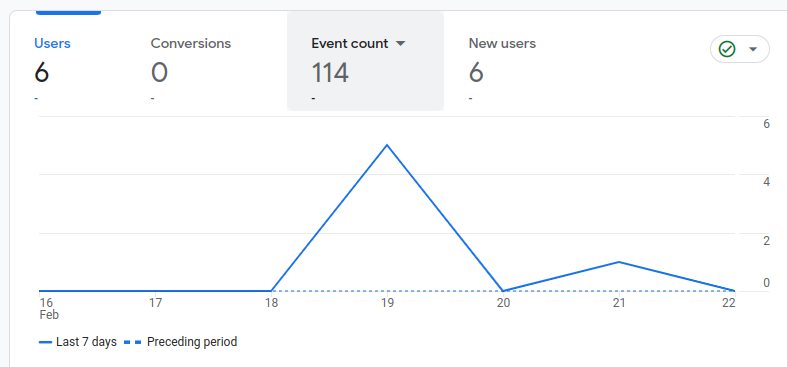

As a restaurant owner, the importance of analytics data cannot be overstated. It provides invaluable insights that can significantly contribute to the success and growth of the business. The automatic dashboards present a comprehensive view of various data sources, each offering unique perspectives on different aspects of the business.

Sales data, for instance, can reveal the most popular dishes, peak business hours, and trends in customer preferences. This information can guide menu planning and promotional strategies. Inventory data, on the other hand, can help manage supply chain efficiency, preventing overstocking or shortages of key ingredients.

Customer feedback is another crucial data source. It provides a direct line to the customers’ thoughts, helping to understand their preferences and areas that require improvement. Employee performance data can highlight the strengths and weaknesses of the staff, guiding training and development initiatives.

Among other data viewed on the dashboard, one particularly interesting data point collected for this lab was the amount of time a user spent on the restaurant’s website. This information, represented in a line graph, can provide insights into user engagement and website effectiveness. For example, longer durations could indicate that users find the content engaging, while shorter durations might suggest the need for website optimization.

In conclusion, analytics data serves as a powerful tool for decision-making in a restaurant business. It provides a clear picture of the restaurant’s performance and guides the management to make informed decisions. The ability to track and analyze such data is indeed a game-changer in the competitive world of the restaurant business.

