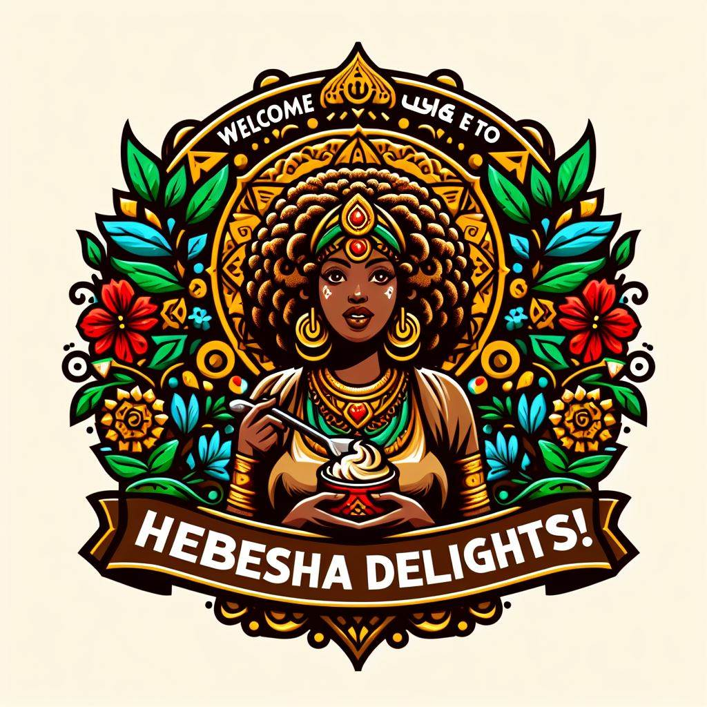

# Welcome to Habesha Delights! 🇪🇹

Welcome to Habesha Delights, where we bring the rich and diverse flavors of Ethiopia right to your plate. Our restaurant offers a unique dining experience, serving traditional Ethiopian dishes in a warm and friendly environment. 

From the moment you step through our doors, you'll be transported to the heart of Ethiopia. The aroma of spices fills the air, traditional music plays softly in the background, and our walls are adorned with beautiful Ethiopian art.

## Our Philosophy 🌍

At Habesha Delights, we believe in the power of food to bring people together. Our dishes are meant to be shared, fostering a sense of community and connection. We source our ingredients from local farmers, ensuring that our food is not only delicious but also sustainable and supportive of our community.

# Reviews 🌟

> "The Kitfo at Habesha Delights was a revelation. The raw meat was delicious, and the spices were perfectly balanced. Can't wait to come back!" - Foodie123

> "As a vegan, I was blown away by the variety and flavors of the Yetsom Beyaynetu. A must-visit for any food lover in town!" - Keith Lee

We're incredibly grateful for the positive feedback we've received from our customers. It's a joy to share our love of Ethiopian cuisine with you.

## Join Us Today! 🎉

Whether you're a longtime fan of Ethiopian food or trying it for the first time, we invite you to join us at Habesha Delights. Experience the warmth of Ethiopian hospitality, the joy of communal eating, and the thrill of discovering new flavors.

We look forward to serving you at Habesha Delights!

{:width="200"}